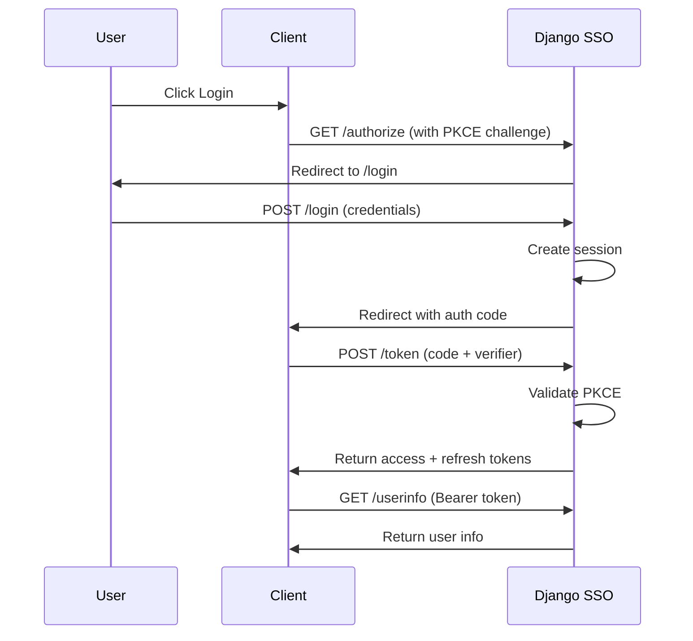

# Django OAuth2 SSO Server - Complete API Documentation

**Version**: 1.0  
**Base URL**: `http://localhost:8000`  
**Protocol**: OAuth 2.0 Authorization Code Flow with PKCE  
**Database**: MySQL  
**Framework**: Django 5.2.8

---

## Table of Contents

1. [Overview](#overview)
2. [Features](#features)
3. [Data Models](#data-models)
4. [Authentication Endpoints](#authentication-endpoints)
5. [User Management Endpoints](#user-management-endpoints)
6. [Token Management](#token-management)
7. [Configuration](#configuration)
8. [Security](#security)
9. [Error Codes](#error-codes)

---

## Overview

This is a production-ready OAuth 2.0 authorization server implementing the Authorization Code Flow with PKCE (Proof Key for Code Exchange). It provides secure authentication and authorization services for client applications.

### Supported Grant Types
- ✅ Authorization Code with PKCE
- ✅ Refresh Token

### Supported Features
- ✅ User registration and authentication
- ✅ OAuth 2.0 client management
- ✅ JWT access tokens (HS256)
- ✅ Token introspection (RFC 7662)
- ✅ JWKS endpoint for public key distribution
- ✅ UserInfo endpoint (OIDC compatible)
- ✅ Session management
- ✅ Token revocation and blacklisting
- ✅ CORS support

---

## Features

### 🔐 Security Features
- **PKCE Support**: Prevents authorization code interception attacks
- **Token Blacklisting**: Revoked access tokens are tracked
- **Session Management**: Server-side session tracking with expiration
- **Password Hashing**: Django's secure password hashing (PBKDF2)
- **CORS Protection**: Configurable allowed origins
- **CSRF Protection**: Built-in Django CSRF middleware

### 🎯 OAuth 2.0 Compliance
- RFC 6749 (OAuth 2.0)
- RFC 7636 (PKCE)
- RFC 7662 (Token Introspection)
- Partial OIDC compatibility (UserInfo endpoint)

### ⚡ Performance
- Database indexing on frequently queried fields
- Token expiration cleanup
- Efficient session management

---

## Data Models

### 1. AuthUser

Custom user model for authentication.

```python
class AuthUser(models.Model):
    id = models.AutoField(primary_key=True)
    username = models.CharField(max_length=150, unique=True)
    email = models.EmailField(unique=True)
    password_hash = models.CharField(max_length=256)
    is_active = models.BooleanField(default=True)
    created_at = models.DateTimeField(auto_now_add=True, db_index=True)
```

**Fields:**
- `id`: Auto-incrementing primary key
- `username`: Unique username (max 150 chars)
- `email`: Unique email address
- `password_hash`: Hashed password using Django's password hashers
- `is_active`: Whether the user account is active
- `created_at`: Timestamp of user creation (indexed)

**Table**: `ssoAuthServer_authuser`

---

### 2. OAuthClient

OAuth 2.0 client application registration.

```python
class OAuthClient(models.Model):
    client_id = models.CharField(max_length=100, primary_key=True)
    client_secret_hash = models.CharField(max_length=256, null=True, blank=True)
    redirect_uris = models.JSONField()
    grant_types = models.JSONField()
    response_types = models.JSONField()
    scope = models.TextField()
    client_name = models.CharField(max_length=150)
    is_confidential = models.BooleanField(default=True)
    created_at = models.DateTimeField(auto_now_add=True)
```

**Fields:**
- `client_id`: Unique client identifier (primary key)
- `client_secret_hash`: Hashed client secret (null for public clients)
- `redirect_uris`: JSON array of allowed redirect URIs
  ```json
  {"redirect_uris": ["http://localhost:8080/callback"]}
  ```
- `grant_types`: JSON array of allowed grant types
- `response_types`: JSON array of allowed response types
- `scope`: Space-separated list of allowed scopes
- `client_name`: Human-readable client name
- `is_confidential`: True for confidential clients, False for public
- `created_at`: Timestamp of client registration

**Table**: `ssoAuthServer_oauthclient`

---

### 3. AuthCode

Temporary authorization codes for OAuth flow.

```python
class AuthCode(models.Model):
    code = models.CharField(max_length=100, primary_key=True)
    user_id = models.ForeignKey(AuthUser, on_delete=models.CASCADE)
    client_id = models.ForeignKey(OAuthClient, on_delete=models.CASCADE)
    redirect_uri = models.TextField()
    scope = models.TextField()
    code_challenge = models.CharField(max_length=256, null=True, blank=True)
    code_challenge_method = models.CharField(max_length=10, null=True, blank=True)
    created_at = models.DateTimeField(auto_now_add=True)
    expires_at = models.DateTimeField(db_index=True)
```

**Fields:**
- `code`: Unique authorization code (primary key)
- `user_id`: Foreign key to AuthUser
- `client_id`: Foreign key to OAuthClient
- `redirect_uri`: The redirect URI used in the authorization request
- `scope`: Requested scopes
- `code_challenge`: PKCE code challenge (SHA256 hash)
- `code_challenge_method`: PKCE method (S256)
- `created_at`: Timestamp of code creation
- `expires_at`: Expiration timestamp (indexed, default: 10 minutes)

**Table**: `ssoAuthServer_oauthcode`

**Indexes**: `(expires_at, user_id)`

**Methods:**
- `is_expired()`: Returns True if code has expired

---

### 4. RefreshToken

Long-lived refresh tokens for obtaining new access tokens.

```python
class RefreshToken(models.Model):
    token = models.CharField(max_length=255, primary_key=True)
    user_id = models.ForeignKey(AuthUser, on_delete=models.CASCADE)
    client_id = models.ForeignKey(OAuthClient, on_delete=models.CASCADE)
    revoked = models.BooleanField(default=False, db_index=True)
    created_at = models.DateTimeField(auto_now_add=True)
    expires_at = models.DateTimeField(db_index=True)
```

**Fields:**
- `token`: Unique refresh token (primary key, URL-safe random string)
- `user_id`: Foreign key to AuthUser
- `client_id`: Foreign key to OAuthClient
- `revoked`: Whether the token has been revoked (indexed)
- `created_at`: Timestamp of token creation
- `expires_at`: Expiration timestamp (indexed, default: 30 days)

**Table**: `refresh_token`

---

### 5. Session

Server-side SSO sessions.

```python
class Session(models.Model):
    session_id = models.CharField(max_length=255, primary_key=True)
    user_id = models.ForeignKey(AuthUser, on_delete=models.CASCADE)
    created_at = models.DateTimeField(auto_now_add=True)
    expires_at = models.DateTimeField(db_index=True)
```

**Fields:**
- `session_id`: Unique session identifier (UUID, primary key)
- `user_id`: Foreign key to AuthUser
- `created_at`: Timestamp of session creation
- `expires_at`: Expiration timestamp (indexed, default: 12 hours)

**Table**: `session`

---

### 6. AccessTokenBlacklist

Blacklist for revoked access tokens.

```python
class AccessTokenBlacklist(models.Model):
    jti = models.CharField(max_length=255, primary_key=True)
    revoked_at = models.DateTimeField(auto_now_add=True, db_index=True)
```

**Fields:**
- `jti`: JWT ID claim from the access token (primary key)
- `revoked_at`: Timestamp of revocation (indexed)

**Table**: `access_token_blacklist`

---

## Authentication Endpoints

### 1. Authorization Endpoint

Initiates the OAuth 2.0 authorization flow.

**Endpoint**: `GET /authorize`

**Parameters:**

| Parameter | Type | Required | Description |
|-----------|------|----------|-------------|
| `client_id` | string | Yes | OAuth client identifier |
| `redirect_uri` | string | Yes | Callback URL (must match registered URI) |
| `response_type` | string | Yes | Must be `code` |
| `scope` | string | No | Space-separated scopes (e.g., `openid profile email`) |
| `state` | string | Recommended | CSRF protection token |
| `code_challenge` | string | Yes (PKCE) | SHA256 hash of code_verifier |
| `code_challenge_method` | string | Yes (PKCE) | Must be `S256` |

**Example Request:**
```
GET /authorize?client_id=frappe_library_management_client&redirect_uri=http://localhost:8080/auth/callback&response_type=code&scope=openid%20profile%20email&state=xyz123&code_challenge=E9Melhoa2OwvFrEMTJguCHaoeK1t8URWbuGJSstw-cM&code_challenge_method=S256
```

**Flow:**
1. Checks if user has active SSO session
2. If not, redirects to `/login` with OAuth parameters
3. If yes, generates authorization code
4. Redirects to `redirect_uri` with code and state

**Success Response:**
```
HTTP/1.1 302 Found
Location: http://localhost:8080/auth/callback?code=AUTHORIZATION_CODE&state=xyz123
```

**Error Responses:**
- `400 Bad Request`: Missing required parameters
- `400 Bad Request`: Invalid client_id
- `400 Bad Request`: Invalid redirect_uri
- `400 Bad Request`: Unsupported response_type

---

### 2. Login Endpoint

User login page and authentication handler.

**Endpoint**: `GET/POST /login`

**GET Parameters:**

| Parameter | Type | Description |
|-----------|------|-------------|
| `client_id` | string | OAuth client ID (forwarded from /authorize) |
| `redirect_uri` | string | Callback URL |
| `response_type` | string | Response type |
| `scope` | string | Requested scopes |
| `state` | string | State parameter |
| `code_challenge` | string | PKCE challenge |
| `code_challenge_method` | string | PKCE method |

**POST Body (JSON):**
```json
{
  "username": "testuser",
  "password": "password123"
}
```

**Success Response:**
```
HTTP/1.1 302 Found
Location: /authorize?client_id=...&redirect_uri=...
```

Creates SSO session and redirects back to `/authorize`.

**Error Response:**
```html
<!-- Renders login.html with error message -->
```

---

### 3. Token Endpoint

Exchanges authorization code for access and refresh tokens.

**Endpoint**: `POST /token`

#### Grant Type: authorization_code

**Headers:**
```
Content-Type: application/json
```

**Body:**
```json
{
  "grant_type": "authorization_code",
  "code": "AUTHORIZATION_CODE",
  "redirect_uri": "http://localhost:8080/auth/callback",
  "client_id": "frappe_library_management_client",
  "code_verifier": "dBjftJeZ4CVP-mB92K27uhbUJU1p1r_wW1gFWFOEjXk"
}
```

**Success Response:**
```json
{
  "access_token": "eyJhbGciOiJIUzI1NiIsInR5cCI6IkpXVCJ9...",
  "token_type": "Bearer",
  "expires_in": 900,
  "refresh_token": "very_long_random_string"
}
```

**Access Token Payload:**
```json
{
  "sub": "1",
  "username": "testuser",
  "client_id": "frappe_library_management_client",
  "exp": 1234567890,
  "iat": 1234567000,
  "jti": "random_jti"
}
```

#### Grant Type: refresh_token

**Body (x-www-form-urlencoded):**
```
grant_type=refresh_token
refresh_token=REFRESH_TOKEN
client_id=frappe_library_management_client
```

**Success Response:**
```json
{
  "access_token": "NEW_ACCESS_TOKEN",
  "token_type": "Bearer",
  "expires_in": 900,
  "refresh_token": "NEW_REFRESH_TOKEN"
}
```

**Error Responses:**
- `400 invalid_request`: Missing required parameters
- `400 invalid_grant`: Invalid or expired code/refresh token
- `400 unsupported_grant_type`: Unsupported grant type

---

### 4. Token Introspection Endpoint

Validates access tokens (RFC 7662).

**Endpoint**: `POST /introspect`

**Authentication**: HTTP Basic Auth (client_id:client_secret)

**Headers:**
```
Content-Type: application/x-www-form-urlencoded
Authorization: Basic <base64(client_id:client_secret)>
```

**Body:**
```
token=ACCESS_TOKEN_HERE
```

**Success Response (Active Token):**
```json
{
  "active": true,
  "scope": "openid profile email",
  "client_id": "frappe_library_management_client",
  "username": "testuser",
  "sub": "1",
  "exp": 1234567890,
  "iat": 1234567000,
  "jti": "random_jti"
}
```

**Success Response (Inactive Token):**
```json
{
  "active": false
}
```

**Error Response:**
```json
{
  "error": "invalid_client"
}
```

---

### 5. UserInfo Endpoint

Returns user information for a valid access token.

**Endpoint**: `GET /userinfo`

**Headers:**
```
Authorization: Bearer ACCESS_TOKEN
```

**Success Response:**
```json
{
  "sub": "1",
  "username": "testuser",
  "email": "testuser@example.com",
  "email_verified": true
}
```

**Error Responses:**
```json
{
  "error": "invalid_request",
  "error_description": "Missing access token"
}
```

```json
{
  "error": "invalid_token",
  "error_description": "Expired"
}
```

---

### 6. Logout Endpoint

Terminates SSO session and revokes tokens.

**Endpoint**: `GET/POST /logout`

#### GET (User-Initiated Logout)

**Parameters:**

| Parameter | Type | Description |
|-----------|------|-------------|
| `post_logout_redirect_uri` | string | URL to redirect after logout |
| `client_id` | string | OAuth client ID |

**Example:**
```
GET /logout?post_logout_redirect_uri=http://localhost:8080&client_id=frappe_library_management_client
```

**Response:**
```
HTTP/1.1 302 Found
Location: http://localhost:8080
```

#### POST (RP-Initiated Logout)

**Authentication**: HTTP Basic Auth

**Body:**
```
token=REFRESH_TOKEN_OR_ACCESS_TOKEN
```

**Success Response:**
```json
{
  "result": "revoked"
}
```

or

```json
{
  "result": "access_token_blacklisted"
}
```

---

### 7. JWKS Endpoint

Returns JSON Web Key Set for JWT verification.

**Endpoint**: `GET /.well-known/jwks.json`

**Response:**
```json
{
  "keys": [
    {
      "kty": "RSA",
      "use": "sig",
      "kid": "default-rsa-key",
      "n": "3e05MvpiakiPoV1XlKshV5nkBfvSAJYK8FCbDRaQZGNdjb3gHVw5GGBq2kHO79bdJUe3hHt0ZpAPJ7s_YcCnMiG-j0eRWDAkLTbepdm_dooEFmzd3eVoylrAqNg88B2Of-cLsapdn-7jCkPGNCqoUSXyt-mEJMTxg694gm0D9iQkfUjqnGnebDHfPiT7q_9oiXZAx-l_xRXjjgUkbIi_1ADPGWOlQbs7eTWMU-VhlAJJnzmJjsNjLODbHhZ9UwcH3ZQyiNcwIvTnEeiYiyo-WIiLiyYbEFA7PezIpjPNdVneSjei5pUg99iHJ-Q_hi4SBKRqGzUIHdLoWrb9kNRyRw",
      "e": "AQAB"
    }
  ]
}
```

---

## User Management Endpoints

### 1. Signup (HTML Form)

User registration with HTML form.

**Endpoint**: `GET/POST /signup`

**GET Parameters**: OAuth parameters (forwarded to login after signup)

**POST Body (Form Data):**
```
username=testuser
email=testuser@example.com
password=password123
confirm_password=password123
```

**Success Response:**
```
HTTP/1.1 302 Found
Location: /login?client_id=...&redirect_uri=...
```

**Error Response:**
```html
<!-- Renders signup.html with error message -->
```

---

### 2. API Signup

User registration via JSON API.

**Endpoint**: `POST /api/signup`

**Headers:**
```
Content-Type: application/json
```

**Body:**
```json
{
  "username": "testuser",
  "email": "testuser@example.com",
  "password": "password123"
}
```

**Success Response:**
```json
{
  "success": true,
  "user": {
    "id": 1,
    "username": "testuser",
    "email": "testuser@example.com"
  }
}
```

**Error Responses:**
```json
{
  "error": "missing_fields"
}
```

```json
{
  "error": "username_taken"
}
```

```json
{
  "error": "email_taken"
}
```

---

## Token Management

### Access Tokens

**Format**: JWT (HS256)  
**Lifetime**: 15 minutes (900 seconds)  
**Algorithm**: HS256  
**Signing Key**: Django SECRET_KEY

**Payload Structure:**
```json
{
  "sub": "user_id",
  "username": "username",
  "client_id": "client_id",
  "exp": 1234567890,
  "iat": 1234567000,
  "jti": "unique_token_id"
}
```

### Refresh Tokens

**Format**: URL-safe random string (48 bytes)  
**Lifetime**: 30 days  
**Storage**: Database (hashed)  
**Rotation**: Yes (new refresh token issued on each refresh)

### Authorization Codes

**Format**: URL-safe random string (32 bytes)  
**Lifetime**: 10 minutes  
**One-time use**: Yes (deleted after exchange)

---

## Configuration

### Environment Variables

Located in `mysite/settings.py`:

```python
# JWT Configuration
SECRET_KEY = 'django-insecure-...'  # Change in production!

# Token Expiration
SSO_ACCESS_TOKEN_EXP = 900  # 15 minutes
SSO_REFRESH_TOKEN_EXP = 60 * 60 * 24 * 30  # 30 days

# SSO Server
SSO_ISS = "http://localhost:8000"

# CORS
CORS_ALLOWED_ORIGINS = [
    "http://localhost:8080",
    "http://127.0.0.1:8080",
]

CORS_ALLOW_CREDENTIALS = True

# Database
DATABASES = {
    'default': {
        'ENGINE': 'django.db.backends.mysql',
        'NAME': 'sso_db',
        'USER': 'root',
        'PASSWORD': 'admin',
        'HOST': 'localhost',
        'PORT': '3306',
    }
}
```

### Session Configuration

```python
SESSION_COOKIE_NAME = "sso_sessionid"
SESSION_COOKIE_SECURE = False  # Set True in production (HTTPS)
SESSION_COOKIE_HTTPONLY = True
SESSION_COOKIE_SAMESITE = "Lax"
```

---

## Security

### Best Practices Implemented

✅ **PKCE Required**: All authorization code flows require PKCE  
✅ **Password Hashing**: Django's PBKDF2 with SHA256  
✅ **Token Rotation**: Refresh tokens are rotated on each use  
✅ **Token Blacklisting**: Revoked access tokens are tracked  
✅ **Session Expiration**: Sessions expire after 12 hours  
✅ **CORS Protection**: Only allowed origins can access  
✅ **CSRF Protection**: Django CSRF middleware enabled  

### Production Recommendations

⚠️ **Use HTTPS**: All endpoints must use HTTPS in production  
⚠️ **Secure Cookies**: Set `SESSION_COOKIE_SECURE = True`  
⚠️ **Strong SECRET_KEY**: Generate a strong, random secret key  
⚠️ **Rate Limiting**: Implement rate limiting on token endpoints  
⚠️ **Audit Logging**: Log all authentication events  
⚠️ **Token Cleanup**: Implement periodic cleanup of expired tokens  

---

## Error Codes

### OAuth 2.0 Error Codes

| Error Code | Description |
|------------|-------------|
| `invalid_request` | Missing or invalid request parameters |
| `invalid_client` | Client authentication failed |
| `invalid_grant` | Invalid authorization code or refresh token |
| `unauthorized_client` | Client not authorized for this grant type |
| `unsupported_grant_type` | Grant type not supported |
| `invalid_scope` | Requested scope is invalid or exceeds allowed scope |

### HTTP Status Codes

| Status | Description |
|--------|-------------|
| `200 OK` | Request successful |
| `302 Found` | Redirect (authorization flow) |
| `400 Bad Request` | Invalid request parameters |
| `401 Unauthorized` | Authentication required or failed |
| `404 Not Found` | Endpoint not found |
| `405 Method Not Allowed` | HTTP method not allowed |
| `500 Internal Server Error` | Server error |

---

## Complete Endpoint Summary

| Endpoint | Method | Auth | Description |
|----------|--------|------|-------------|
| `/authorize` | GET | Session | OAuth authorization endpoint |
| `/login` | GET/POST | None | User login page |
| `/signup` | GET/POST | None | User registration (HTML) |
| `/api/signup` | POST | None | User registration (API) |
| `/token` | POST | Client | Token exchange/refresh |
| `/introspect` | POST | Client | Token validation |
| `/userinfo` | GET | Bearer | User information |
| `/logout` | GET/POST | Session/Client | Logout and token revocation |
| `/.well-known/jwks.json` | GET | None | Public keys for JWT verification |

---

## Example OAuth Flow



---

## Support

For issues or questions:
- Check the [Postman Testing Guide](file:///Users/tuguldur/.gemini/antigravity/brain/93cb701f-6cbf-42d4-bb61-ddd6e95260ba/postman_testing_guide.md)
- Review Django logs for error details
- Verify OAuth client configuration in Django admin

---

**Last Updated**: 2026-02-06  
**Django Version**: 5.2.8  
**Python Version**: 3.x
